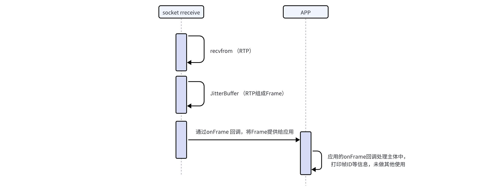
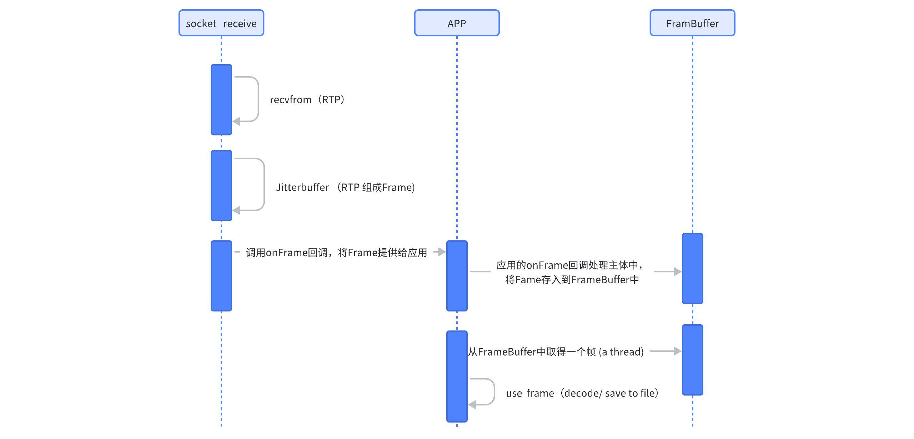
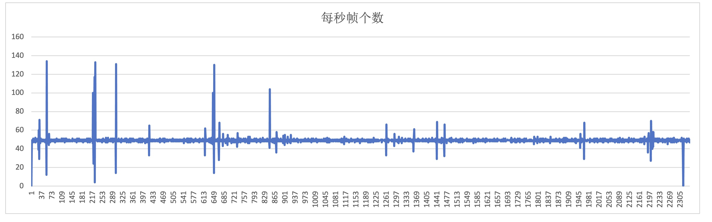
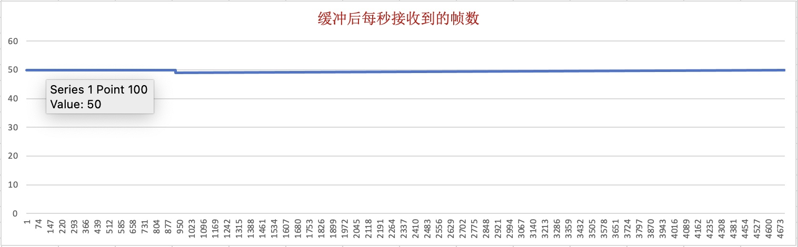
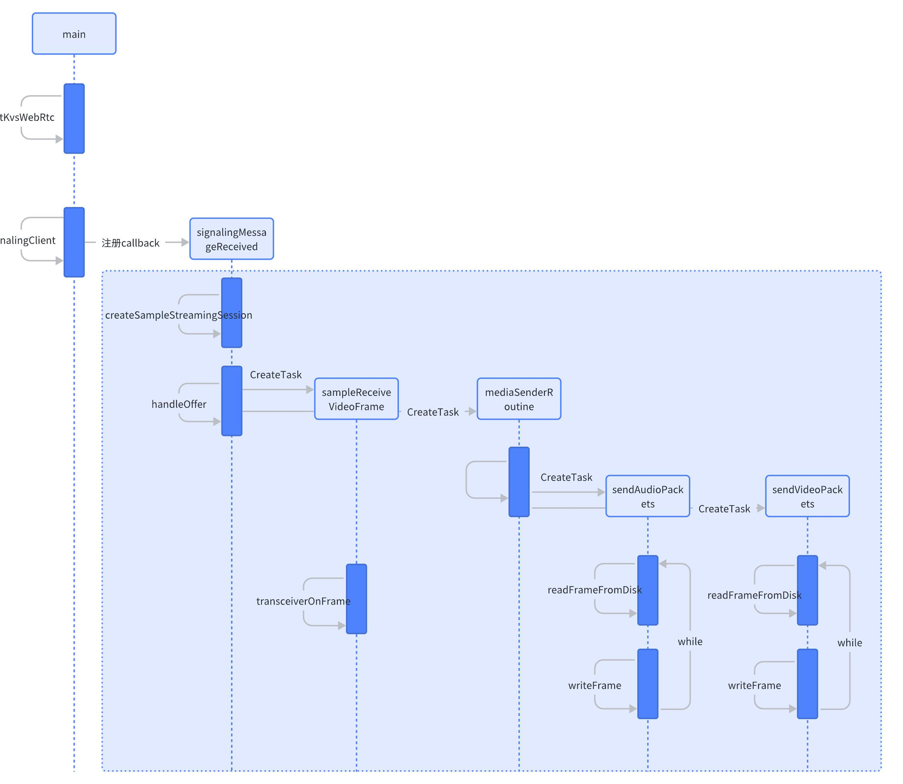
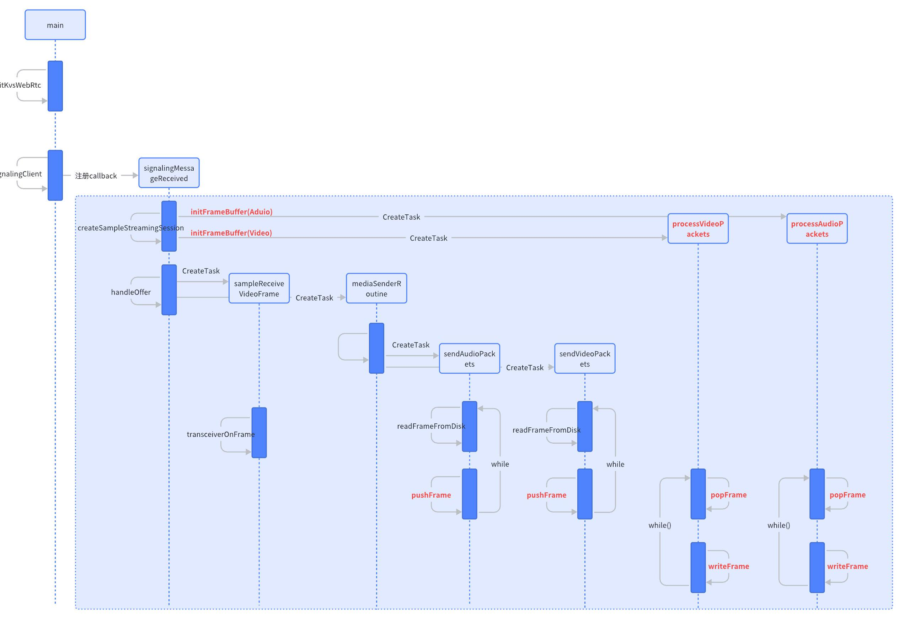
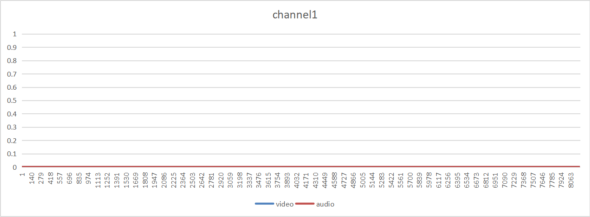
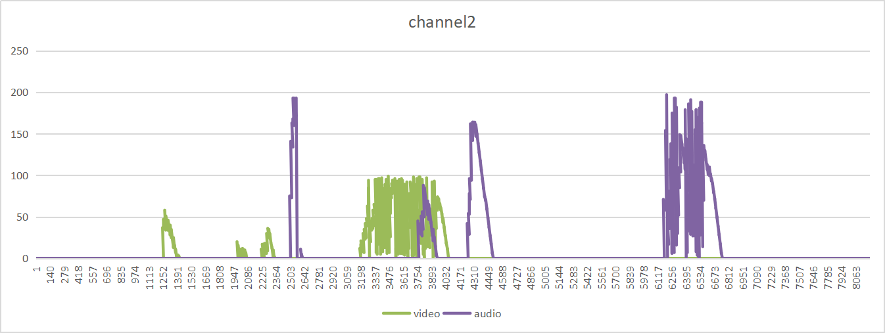
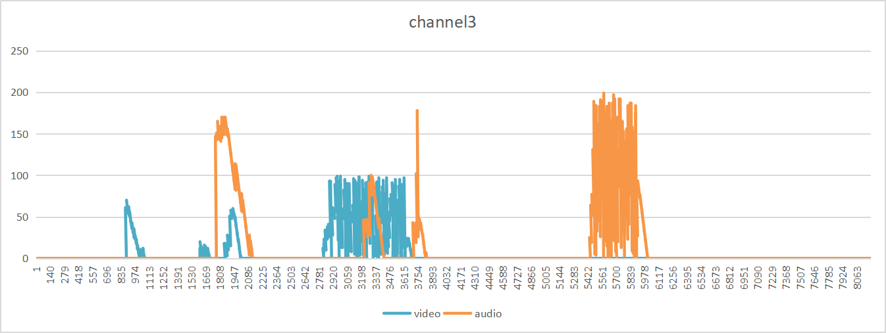

**WebRTC 帧收发缓冲**

# 1. **数据结构**

## 1.1 **数据类型**

下面是帧数据的结构（已有）

```C
  /* The representation of the Frame */
  typedef struct {
	  UINT32 version;
	  // Id of the frame
	  UINT32 index;
	  // Flags associated with the frame (ex. IFrame for frames)
	  FRAME_FLAGS flags;
	  // The decoding timestamp of the frame in 100ns precision
	  UINT64 decodingTs;
	  // The presentation timestamp of the frame in 100ns precision
	  UINT64 presentationTs;
	  // The duration of the frame in 100ns precision. Can be 0.
	  UINT64 duration;
	  // Size of the frame data in bytes
	  UINT32 size;
	  // The frame bits
	  PBYTE frameData;
	  // Id of the track this frame belong to
	  UINT64 trackId;
  } Frame, *PFrame;

```

使用已有的帧数据结构，缓冲buffer的数据结构设计如下：

```C
 typedef struct {                                                      
	 // 使用者计划下次需要使用的帧ID                                       
	 UINT32 nextConsumedFrameId;                                           
	 // 使用者最后一次使用的帧ID                                           
	 UINT32 lastConsumedFrameId; 
	 // 记录当前缓冲区中最小ID的帧（即需要最先被使用的帧）
	 UINT32 headerFrameId;  
	 // 记录当前缓冲区中最大ID的帧（即需要最后被使用的帧）
	 UINT32 tailFrameId;                                                  
	 // 用于线程间的同步和共享资源的互斥访问                              
	 MUTEX mutex;                                                         
	 CVAR cond;                                                           
	 // 标明是缓存接收帧，还是缓存发送帧                                  
	 BOOL recvFlag;                                                       
	 // 标明缓冲区的最大size                                              
	 UINT16 maxSize;                                                      
	 // 帧数据的缓冲列表（Frame结构数据的链表）                           
	 PDoubleList pFrameList;                                              
 } FrameBuffer, *PFrameBuffer                                         
```

## 1.2 **FramBuffer模块的接口**

下面列出了帧缓冲模块提供的接口

| 原型  | PFrameBuffer initFrameBuffer(BOOL revFlag, UINT16 max)         |
|:-----:|:----------------------------------------------------------------|
| 功能  | 初始化FrameBuffer模块                                          |
| 参数  | revFlag：标明是接收端还是发送端。TRUE：接收端，FALSE：发送端  |
|     | max：设置FrameBuffer的最大容量                                           |
| 返回值  | 执行初始化后的FrameBuffer 的指针                               |


| 原型  | STATUS pushFrame(PFrameBuffer pBuf, PFrame pFrame)             |
|:-----:|:----------------------------------------------------------------|
| 功能  | 向FrameBuffer中插入一帧                                        |
| 参数  | pBuf：指向FrameBuffer的指针                                    |
|     | pFrame：指向需要插入的帧的指针                                 |
| 返回值  | STATUS_SUCCESS：执行成功；其他 ：失败                          |


| 原型  | STATUS popFrame(PFrameBuffer pBuf, PFrame *ppFrame)           |
|:-----:| :----------------------------------------------------------------|
| 功能  | 从FrameBuffer中取出一帧                                        |
| 参数  | pBuf：指向FrameBuffer的指针                                    |
|     | ppFrame：指向取出的帧的指针                                    |
| 返回值  | STATUS_SUCCESS：执行成功；其他 ：失败                          |


| 原型  | STATUS deleteFrame(PFrameBuffer pBuf)                          |
|:-----:|:-----------------------------------------------------------------|
| 功能  | 从FrameBuffer中删除最旧的一帧                                  |
| 参数  | pBuf：指向FrameBuffer的指针                                    |
| 返回值  | STATUS_SUCCESS：执行成功；其他 ：失败                          |


| 原型  | STATUS deInitFrameBuffer(BOOL revFlag, PFrameBuffer pBuf)      |
|:------:|:----------------------------------------------------------------|
| 功能  | 释放Frame Buffer所占内存                                       |
| 参数  | revFlag：标明是接收端还是发送端。TRUE：接收端，FALSE：发送端   |
|     | pBuf：指向Frame Buffer所占内存的指针                           |
| 返回值  | STATUS_SUCCESS：执行成功；其他 ：失败                          |

# 2. **接收端处理**

## 2.1 **原有的接收端处理过程如下：**

1.  socket receive从网络上接收帧数据，并且通过JitterBuffer后，获得到完整的数据帧；

2.  调用onFrame回调，将数据帧抛出给应用（APP）；

3.  应用的onFrame回调处理主体中，打印帧的ID等信息，未做其他处理；



## 2.2 **添加FrameBuffer模块后，接收端的处理如下**

1.  socket receive从网络上接收帧数据，并且通过JitterBuffer后，获得到完整的数据帧；

2.  调用onFrame回调，将数据帧抛出给应用（APP）；

3.  应用的onFrame回调处理主体中，将Frame存入到FrameBuffer中；

4.  APP从FrameBuffer模块中取得一个帧进行使用（比如解码器进行解码，或存储为文件等），通常这部分会启动一个新的线程去从FrameBuffer中获取一个帧数据；

大概的帧流向如下图所示：



## 2.3 **帧乱序的处理**

发送端按照顺序发送数据帧。但是帧被发送到网络中后，由于网络的路由等处理，接收端不能保证接收到的数据帧一定是按照发送顺序接收到的，所以在接收到数据帧后，需要将新接收到的帧放到正确的位置，以保证帧的有序性。

对于帧乱序的处理，有如下3种方式插入新帧：

1.  从头查找插入法：每次都从链表的头开始查找，直到找到合适位置，然后插入。

2.  两头查找插入法：将需要插入的帧的ID与链表头和尾这两帧的ID进行比较，如果离头近，那么从头开始查找，直到找到位置，然后插入；如果离尾近，那么从尾开始往前查找，知道找到位置然后插入。

3.  二分查找（折半查找）插入法：

对上面3种方式的耗时时间按照如下方法进行统计

前提：在模拟帧乱序接收并保存帧时，首先预置了一个双向链表（double
list），按照如下方式创建

```C
  #define MAX_COUNT 200
  
  PFrameBuffer pBuf= initFrameBuffer(TRUE, MAX_COUNT + 1);
  for (int i = 0; i < MAX_COUNT + 1; i += 2) {
	  frame.index = i;
	  pushFrame(pBuf, &frame)；
  }

```

创建后，链表中帧ID按照顺序为0,2,4 ......
196,198,200。链表预置好后，向其中插入新的数据，新插入的数据帧ID为1,3,5,7...... 195, 197,
199，插入新帧按照如下方式,并且记录开始插入前的时间（startTime）和1~199这100帧全部插入完成后的时间（endTime），计算获得两次时间差elapsed 。

```C
  startTime = GETTIME();
  for (int i = 1; i < MAX_COUNT ; i += 2) {
	  frame.index = i;
	  pushFrame(pBuf, &frame);
  }
  endTime = GETTIME();
  elapsed = endTime - startTime;

```

3种插入方式，每种重复执行50次，获得3种方式下elapsed的平均值

  
  |插入方式                     | 所耗平均时间|
  |-----------------------------| ---------------|
  |从头查找插入法：             | 155.300us|
  |两头查找插入法               | 105.200 us|
  |二分查找（折半查找）插入法   | 298.500 us|

  按照上面方式获得的时间值，在Frame Buffer模块中，采用两头查找插入法实现帧乱序的校正，关键代码部分如下：

```C
  UINT32 hIndex = ((PFrame)(pBuf->pFrameList->pHead->data))->index;
  UINT32 tIndex = ((PFrame)(pBuf->pFrameList->pTail->data))->index;
  
  if ((pNewFrame->index - hIndex) <= (tIndex - pNewFrame->index)) {
	  CHK_STATUS(doubleListGetHeadNode(pBuf->pFrameList, &pCurNode));
	  while (pCurNode != NULL) {
		  pNextNode = pCurNode->pNext;
		  pCurFrame = (PFrame) pCurNode->data;
		  pNextFrame = (PFrame) pNextNode->data;
		  if (pCurFrame->index < pNewFrame->index && pNewFrame->index < pNextFrame->index) {
			  doubleListInsertItemAfter(pBuf->pFrameList, pCurNode, (UINT64) pNewFrame);
			  break;
		  }
		  pCurNode = pNextNode;
	  }
  } else {
	  CHK_STATUS(doubleListGetTailNode(pBuf->pFrameList, &pCurNode));
	  while (pCurNode != NULL) {
		  pPrevNode = pCurNode->pPrev;
		  pCurFrame = (PFrame) pCurNode->data;
		  pNextFrame = (PFrame) pPrevNode->data;
		  if (pCurFrame->index > pNewFrame->index && pNewFrame->index > pNextFrame->index) {
			  doubleListInsertItemBefore(pBuf->pFrameList, pCurNode, (UINT64) pNewFrame);
			  break;
		  }
		  pCurNode = pPrevNode;
	  }
  }

```
## 2.4 **缓冲数据后的测试结果**

测试方法：

1.  不同局域网环境，准备一个Ubuntu机器，一个windows笔记本，一个手机，连接到一个路由器上

2.  Ubuntu机器运行kvsWebRtcClientMaster

3.  在手机浏览器运行 [Testpage Viwer](https://awslabs.github.io/amazon-kinesis-video-streams-webrtc-sdk-js/examples/index.html)

4.  当Viewer显示出音视频后，播放一会，可以将路由器远离Ubuntu设备，制造一种Master的弱网环境，测试出的帧缓存如下：

5. kvsWebrtcClientViewer程序接收帧时，帧缓冲前明顯多個范围的波动，帧缓冲后（先放入缓存buffer中，再从buffer中拿取帧），明顯改善平滑接收。


# 3. **发送端处理**

## 3.1 **原始的发送端实现**



原始sample中，第一次连接时会启动两个数据发送线程sendAudioPackets和sendVideoPackets，这两个线程一旦启动后即不会关闭。以sendVideoPackets为例，每间隔40ms发送一次数据，每次发送数据都分为两步：

1.  调用readFrameFromDisk从文件读取一帧

2.  通过writeFrame发送到socket，这里注意for (i = 0; i <
    pSampleConfiguration->streamingSessionCount;
    ++i)，连接了几个session（也就是连接了几个viewer），每帧数据就要循环发送几次；

这里就会存在几个问题：

1.  发送的数据不缓存，如果某帧发送失败，那么该帧就丢掉了，接收掉看到就是有掉帧现象

2.  当几个session同时连接时，发送数据是线性发送的，一个session网络状况不佳，发送数据耗时长，会直接影响到所有session数据的发送

```C
  PVOID sendVideoPackets(PVOID args)
  {
	  ......
	  while (!ATOMIC_LOAD_BOOL(&pSampleConfiguration->appTerminateFlag)) {
		  fileIndex = fileIndex % NUMBER_OF_H264_FRAME_FILES + 1;
		  SNPRINTF(filePath, MAX_PATH_LEN, "./h264SampleFrames/frame-%04d.h264", fileIndex);
		  
		  CHK_STATUS(readFrameFromDisk(NULL, &frameSize, filePath));
		  
		  // Re-alloc if needed
		  if (frameSize > pSampleConfiguration->videoBufferSize) {
			  pSampleConfiguration->pVideoFrameBuffer = (PBYTE) MEMREALLOC(pSampleConfiguration->pVideoFrameBuffer, frameSize);
			  CHK_ERR(pSampleConfiguration->pVideoFrameBuffer != NULL, STATUS_NOT_ENOUGH_MEMORY, "[KVS Master] Failed to allocate video frame buffer");
			  pSampleConfiguration->videoBufferSize = frameSize;
		  }
		  
		  frame.frameData = pSampleConfiguration->pVideoFrameBuffer;
		  frame.size = frameSize;
		  
		  CHK_STATUS(readFrameFromDisk(frame.frameData, &frameSize, filePath));
		  
		  // based on bitrate of samples/h264SampleFrames/frame-*
		  encoderStats.width = 640;
		  encoderStats.height = 480;
		  encoderStats.targetBitrate = 262000;
		  frame.presentationTs += SAMPLE_VIDEO_FRAME_DURATION;
		  MUTEX_LOCK(pSampleConfiguration->streamingSessionListReadLock);
		  for (i = 0; i < pSampleConfiguration->streamingSessionCount; ++i) {
			  status = writeFrame(pSampleConfiguration->sampleStreamingSessionList[i]->pVideoRtcRtpTransceiver, &frame);
			  if (pSampleConfiguration->sampleStreamingSessionList[i]->firstFrame && status == STATUS_SUCCESS) {
				  PROFILE_WITH_START_TIME(pSampleConfiguration->sampleStreamingSessionList[i]->offerReceiveTime, "Time to first frame");
				  pSampleConfiguration->sampleStreamingSessionList[i]->firstFrame = FALSE;
			  }
			  encoderStats.encodeTimeMsec = 4; // update encode time to an arbitrary number to demonstrate stats update
			  updateEncoderStats(pSampleConfiguration->sampleStreamingSessionList[i]->pVideoRtcRtpTransceiver, &encoderStats);
			  if (status != STATUS_SRTP_NOT_READY_YET) {
				  if (status != STATUS_SUCCESS) {
					  DLOGV("writeFrame() failed with 0x%08x", status);
				  }
			  }
		  }
		  MUTEX_UNLOCK(pSampleConfiguration->streamingSessionListReadLock);
		  
		  // Adjust sleep in the case the sleep itself and writeFrame take longer than expected. Since sleep makes sure that the thread
		  // will be paused at least until the given amount, we can assume that there's no too early frame scenario.
		  // Also, it's very unlikely to have a delay greater than SAMPLE_VIDEO_FRAME_DURATION, so the logic assumes that this is always
		  // true for simplicity.
		  elapsed = lastFrameTime - startTime;
		  THREAD_SLEEP(SAMPLE_VIDEO_FRAME_DURATION - elapsed % SAMPLE_VIDEO_FRAME_DURATION);
		  lastFrameTime = GETTIME();
	  }
  }

```

## 3.2 **添加数据缓存后的发送端实现**



1.  在接收到Viewer端的SDP OFFER后，调用createSampleStreamingSession创建session，在createSampleStreamingSession中分别初始化video和audio的缓存buffer，同时创建两个处理线程process VideoPackets和process AudioPackets；这样每个session都有自己的缓冲buffer及处理线程，互不影响；这里video的FrameBuffer长度设为100，audio的FrameBuffer长度设为200；因为video是每秒25帧，audio是每秒50帧，如此设置，即大概缓存4s中的音视频数据；

2.  在sendVideoPackets中，每40ms读取一帧视频数据，将数据插入到每个session的缓存buffer中；

3.  在process VideoPackets处理时，只要对应的FrameBuffer中有数据，就通过popFrame获取一帧，经writeFrame发送到socket；发送成功后，会从FrameBuffer中清除该帧；如果该帧发送失败，该帧不清除，继续尝试发送；

```C
  PVOID sendVideoPackets(PVOID args)
  {
	  ......
	  while (!ATOMIC_LOAD_BOOL(&pSampleConfiguration->appTerminateFlag)) {
		  ......
		  for (i = 0; i < pSampleConfiguration->streamingSessionCount; ++i) {
			pushFrame(pSampleConfiguration->sampleStreamingSessionList[i]->pCacheVideoFrame, &frame);
		  }
	  }
	  ......
  }
  
  PVOID processVideoPackets(PVOID args)
  {
	  ......
	  while (!ATOMIC_LOAD_BOOL(&pSampleStreamingSession->terminateFlag)) {
		  // based on bitrate of samples/h264SampleFrames/frame-*
		  encoderStats.width = 640;
		  encoderStats.height = 480;
		  encoderStats.targetBitrate = 262000;
		  
		  status = popFrame(pSampleStreamingSession->pCacheVideoFrame, &pFrame);
		  if (STATUS_SUCCESS == status) {
			  status = writeFrame(pSampleStreamingSession->pVideoRtcRtpTransceiver, pFrame);
			  if (pSampleStreamingSession->firstFrame && status == STATUS_SUCCESS) {
				  PROFILE_WITH_START_TIME(pSampleStreamingSession->offerReceiveTime, "Time to first frame");
				  pSampleStreamingSession->firstFrame = FALSE;
			  }
			  encoderStats.encodeTimeMsec = 4; // update encode time to an arbitrary number to demonstrate stats update
			  updateEncoderStats(pSampleStreamingSession->pVideoRtcRtpTransceiver, &encoderStats);
			  if (status != STATUS_SRTP_NOT_READY_YET) {
				  if (status != STATUS_SUCCESS) {
					  DLOGV("writeFrame() failed with 0x%08x", status);
				  } else {
					  deleteFrame(pSampleStreamingSession->pCacheVideoFrame, pFrame);
				  }
			  } else {
				  deleteFrame(pSampleStreamingSession->pCacheVideoFrame, pFrame); // Discard packets till SRTP is ready
			  }
		  }
	  }
	  ......
  }

```

## 3.3 **缓冲数据后的测试结果**

测试方法：

1.  同一局域网环境，准备一个Ubuntu机器，一个windows笔记本，一个手机，连接到一个路由器上

2.  Ubuntu机器运行kvsWebRtcClientMaster

3.  分别在Ubuntu机器上的浏览器（channel1），windows笔记本浏览器（channel2），和手机浏览器（channel3）
    运行testpage(https://awslabs.github.io/amazon-kinesis-video-streams-webrtc-sdk-js/examples/index.html)

4.  当三个Viewer都显示出音视频后，播放一会，可以将路由器远离Ubuntu设备，制造一种Master的弱网环境，测试出的帧缓存如下：



channel1基本无缓存，生产一帧数据，即发送一帧数据；





channel2和channel3都会根据网络的情况产生一些缓存buffer，当网络恢复时，缓冲帧会逐步发送。

# 4. **未尽问题**

## 4.1 **接收端**

在原有的sample上添加了Frame
Buffer后，接收端还有如下问题可能需要再进一步处理：

1.  关键帧：现在实现的是当Buffer满时，就将Buffer内现有的所有帧都清除掉，然后将新收到的帧存入到Buffer中。这样就会丢掉很多帧，同时，因为没有关键帧的判断，有可能在丢掉帧后，视频解码会出现花屏等问题，音频解码可能会出现噪音等问题。如果加入关键帧的判断，且在关键帧时才清空buffer，那么虽然也会丢掉很多帧，但是可以在一定程度上保证解码后的音视频不会出现花屏和噪音等问题。

2.  解码：现在代码包中未提供解码相关的接口，所以对接收到的帧不能进行解码；

3.  音视频同步：如果向用户提供音视频播放，那么需要做音视频同步；

4.  其他：如果接收端不对音视频进行播放，而是保存为文件，那么还需要对裸帧进行封装，封装成可以播放的文件格式（例如：MP4等）。
